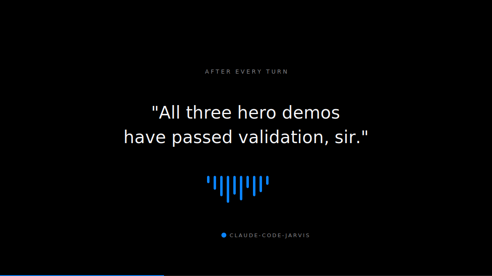
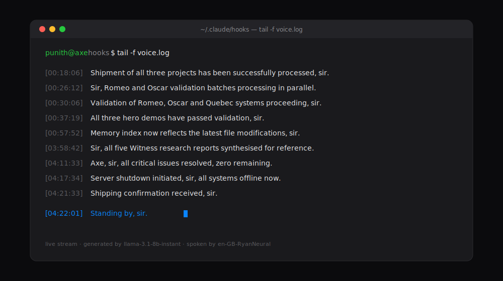

# claude-code-jarvis

### [Solved!!] — how giving your Claude Code a voice saves a ton of time when you're juggling multiple workflows and terminals.

A Stop-hook kit that makes Claude Code *speak* after every turn. Built for devs running 3–4 Claude sessions at once who can't watch every terminal.



---

## The problem

You're running four Claude Code sessions. One migrating a DB. One building a bundle. One running tests. One deploying a preview. **You physically cannot watch four terminals at once** — so you miss when things finish, and worse, you miss when things break.

## The fix

A Stop hook fires after every Claude turn. It grabs the last message, sends it to a fast LLM (~300ms), and speaks a contextual one-liner in a British butler voice. You hear:

> *"Preview deployment live on Vercel, sir."*

And you know which workflow just finished — without alt-tabbing, without losing focus on the session you're actually in.



Those lines above are real, pulled straight from `voice.log`. None are scripted — each is generated fresh from the message that just landed.

---

## Key features

- 🔊 **Contextual voice, not canned TTS** — every line is LLM-generated from what Claude actually just said
- ⚡ **Sub-10ms hook** — fully async; Claude never blocks waiting on voice
- 🧠 **Groq `llama-3.1-8b-instant`** — ~300ms round-trip, free tier (30 req/min), plenty for heavy solo work
- 🇬🇧 **British butler voice** — `edge-tts` with `en-GB-RyanNeural`, A/B tested against 4 alternatives
- 🛟 **Graceful fallback** — cached MP3s play if the LLM call fails, never silent
- 💰 **Free to run** — no paid APIs, no local models, no build step
- 🧩 **Swap anything** — different voice, different model, different callsign, all one-line edits

## Requirements

- macOS (uses `afplay`)
- Python 3.10+
- `jq`, `curl` → `brew install jq curl`
- A free Groq API key → [console.groq.com/keys](https://console.groq.com/keys)

## Install

```bash
git clone https://github.com/filmy-munky/claude-code-jarvis.git
cd claude-code-jarvis
./install.sh
```

The installer copies the hook to `~/.claude/hooks/`, installs `edge-tts`, and creates a `.env` template. Then:

1. Paste your Groq key into `~/.claude/hooks/.env`
2. Merge the `Stop` hook block from `settings.json.example` into `~/.claude/settings.json`
3. Open a new Claude Code session — after the first reply you'll hear a chime and a spoken line

Total setup time: **under 3 minutes**.

## Configure

Edit `~/.claude/hooks/axe-voice.sh`:

| Variable | Default | What to change it to |
|----------|---------|----------------------|
| `EDGE_VOICE` | `en-GB-RyanNeural` | Run `python3 -m edge_tts --list-voices` for alternatives |
| `GROQ_MODEL` | `llama-3.1-8b-instant` | Swap for `llama-3.3-70b-versatile` for smarter (slower) lines |

Drop `CLAUDE.md.example` into `~/.claude/CLAUDE.md` to make Claude's *written* tone match the voice.

## Files

| Path | Purpose |
|------|---------|
| `hooks/axe-voice.sh` | The Stop hook — tails transcript, calls Groq, speaks via edge-tts |
| `hooks/.env.example` | Template for `GROQ_API_KEY` |
| `hooks/voice-cache/` | Fallback MP3s if the LLM call fails |
| `settings.json.example` | Stop hook wiring for `~/.claude/settings.json` |
| `CLAUDE.md.example` | JARVIS persona prompt for the text layer |
| `install.sh` | One-shot installer |
| `assets/ad.html` | Self-contained Apple-ad animation (22s loop, screen-record ready) |
| `screenshots/` | Visual assets for this README |

## Troubleshooting

Tail `~/.claude/hooks/voice.log` — every invocation logs there.

- **Silent** → missing `GROQ_API_KEY`, `jq`, `edge-tts`, or wrong `PYTHON_BIN` in the hook
- **Voice spells "A dot X dot E dot"** → your persona file has the name as `A.X.E.`; use `AXE` as one word
- **Generic lines only** → Groq call is failing; check `voice.log` for HTTP errors

---

Built by [Punith Gowda](https://github.com/filmy-munky)
